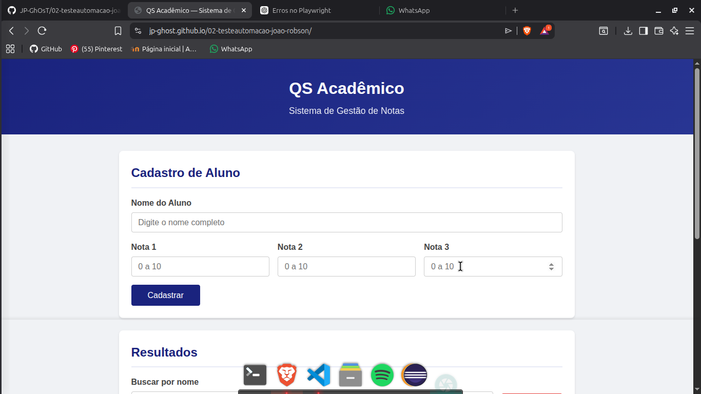
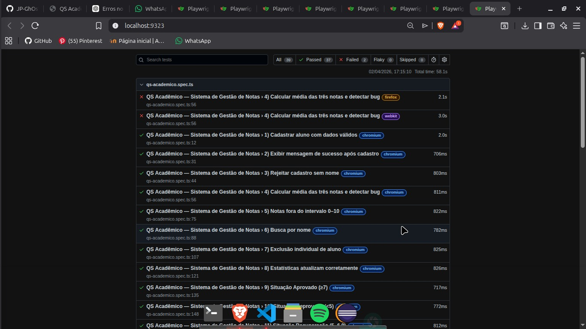
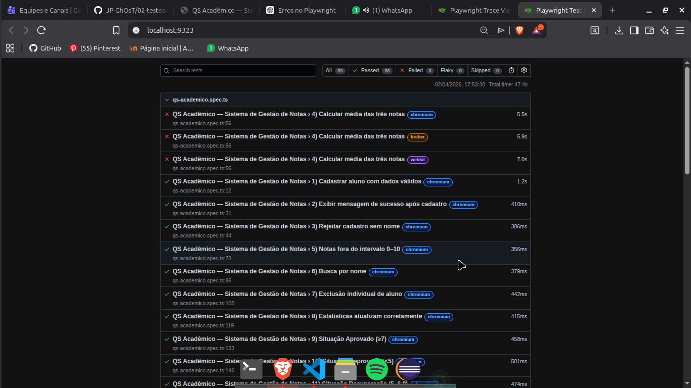
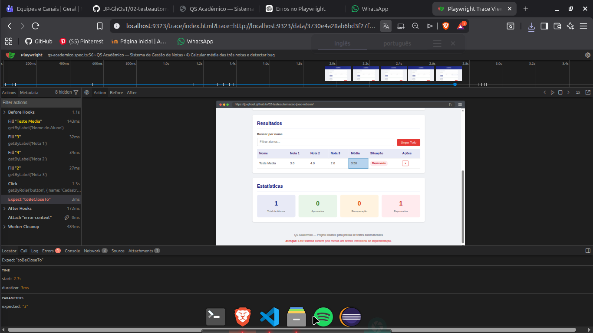

# Documento de Entregáveis — Automação de Testes com Playwright

**Aluno(a):** João Paulo Zimmermann Matsui
**Dupla (se aplicável):** Robson dos Santos Damasceno Lisboa  
**Data:** 02/04/2026  
**Repositório (fork):** `https://github.com/JP-GhOsT/02-testeautomacao-joao-robson`  
**GitHub Pages:** `https://jp-ghost.github.io/02-testeautomacao-joao-robson/`

---

## Entregável 1 — Fork do Repositório e GitHub Pages

| Item | Valor |
|------|-------|
| **URL do fork no GitHub** | `https://github.com/JP-GhOsT/02-testeautomacao-joao-robson` |
| **URL do site no GitHub Pages** | `https://jp-ghost.github.io/02-testeautomacao-joao-robson/` |
| **Site está acessível e funcional?** | ☐ Sim / ☐ Não |

**Evidência:** 

---

## Entregável 2 — Projeto Playwright com Testes

### 2.1 Teste gerado pelo Codegen

| Item | Detalhes |
|------|----------|
| **Arquivo** | `testes-playwright/tests/qs-academico-codegen.spec.ts` |
| **Ações gravadas** | ☐ Cadastro de "Ana Silva" (8, 7, 9) |
|                     | ☐ Cadastro de "Carlos Lima" (5, 4, 6) |
|                     | ☐ Busca por "Ana" |
|                     | ☐ Exclusão do segundo aluno |
| **Teste executa com sucesso?** | ☐ Sim / ☐ Não |

**Reflexão sobre o Codegen:** _(Que tipo de seletores o Codegen utilizou? São os mais indicados? Justifique.)_

> O Codegen do Playwright gerou seletores como getByLabel(), getByRole() e getByText().

getByLabel() foi usado para preencher campos de formulário. É bom porque depende do texto do rótulo, que é fácil de ler e não muda com frequência.
getByRole() foi usado para clicar em botões. Também é bom, porque usa o papel do elemento (role) e o texto visível, seguindo boas práticas de acessibilidade.
getByText() foi usado para localizar mensagens ou textos na tela. Funciona, mas pode gerar problemas se o mesmo texto aparecer em mais de um lugar.

Conclusão: Os seletores usados são legíveis e funcionam na maioria dos casos, mas para textos que aparecem várias vezes, é melhor usar um identificador único como data-testid para evitar conflitos.

### 2.2 Testes escritos manualmente

| Item | Detalhes |
|------|----------|
| **Arquivo** | `testes-playwright/tests/qs-academico.spec.ts` |

**Checklist dos testes implementados:**

| # | Teste | Implementado | Passa? |
|---|-------|:------------:|:------:|
| 1 | Cadastrar aluno com dados válidos | ☐ | ☐ Sim / ☐ Não |
| 2 | Exibir mensagem de sucesso após cadastro | ☐ | ☐ Sim / ☐ Não |
| 3 | Rejeitar cadastro sem nome | ☐ | ☐ Sim / ☐ Não |
| 4 | Calcular a média aritmética das três notas | ☐ | ☐ Sim / ☐ Não |
| 5 | Validação de notas fora do intervalo (0–10) | ☐ | ☐ Sim / ☐ Não |
| 6 | Busca por nome (filtro) | ☐ | ☐ Sim / ☐ Não |
| 7 | Exclusão individual de aluno | ☐ | ☐ Sim / ☐ Não |
| 8 | Estatísticas (totais por situação) | ☐ | ☐ Sim / ☐ Não |
| 9 | Situação — Aprovado (média ≥ 7) | ☐ | ☐ Sim / ☐ Não |
| 10 | Situação — Reprovado (média < 5) | ☐ | ☐ Sim / ☐ Não |
| 11 | Situação — Recuperação (média ≥ 5 e < 7) | ☐ | ☐ Sim / ☐ Não |
| 12 | Múltiplos cadastros (3 alunos → 3 linhas) | ☐ | ☐ Sim / ☐ Não |

---

## Entregável 3 — Relatório HTML do Playwright

### 3.1 Relatório ANTES da correção do defeito

**Evidência:** 

| Métrica | Valor |
|---------|-------|
| **Total de testes** | 39 |
| **Testes aprovados (passed)** | 36 |
| **Testes reprovados (failed)** | 3 |
| **Navegadores testados** | 3 |

### 3.2 Relatório DEPOIS da correção do defeito

**Evidência:** 

| Métrica | Valor |
|---------|-------|
| **Total de testes** | 39 |
| **Testes aprovados (passed)** | 39 |
| **Testes reprovados (failed)** | 0 |
| **Navegadores testados** | 3 |

---

## Entregável 4 — Registro do Defeito Encontrado

| Campo | Descrição |
|-------|-----------|
| **Título do defeito** | _(Calcular média das três notas)_ |
| **Severidade** | ☐ Crítica / ☐ Alta / ☐ Média / ☐ Baixa |
| **Componente afetado** | _(função `calcularMedia` em `docs/js/app.js`)_ |
| **Passos para reproduzir** | 1. preenche o nome do aluno.
|                            | 2. insere as notas 3,4 e 2
|                            | 3. clica no botão de CADASTRO
|                            | 4. pega o resultado final na tabela
| **Resultado esperado** | _(o resultado final deveria dar 3)_ |
| **Resultado obtido** | _(o resultado final deu 3,5)_ |
| **Teste(s) que revelaram o defeito** | _(teste 4)_ |
| **Evidência visual** | _()_ |

### Análise do Trace Viewer

| Aspecto | Observação |
|---------|------------|
| **Em qual asserção o teste falhou?** | 4 |
| **Valor esperado** | 3 |
| **Valor obtido** | 3,5 |
| **Screenshot do momento da falha** |  |

### Exemplo de cálculo demonstrando o defeito

| Notas inseridas | Média esperada (correta) | Média exibida (com defeito) | Diferença |
|:---------------:|:------------------------:|:---------------------------:|:---------:|
| N1= \ 7 \, N2=\7\, N3=\_\_ | | | |
| N1=\_\_, N2=\_\_, N3=\_\_ | | | |
| N1=\_\_, N2=\_\_, N3=\_\_ | | | |

---

## Entregável 5 — Correção do Defeito

| Item | Detalhes |
|------|----------|
| **Arquivo corrigido** | `docs/js/app.js` |
| **Função corrigida** | calcularMedia |
| **Código original (com defeito)** | _((nota1 + nota2) / 2)_ |
| **Código corrigido** | _((nota 1 + nota 2 + nota3) / 3)_ |
| **Hash do commit** | 34d77cb..50f59ac  |
| **Mensagem do commit** | "fix: arruma calculo na media" |

**Validação pós-correção:**

- ☐ Todos os testes passam após a correção
- ☐ O site no GitHub Pages foi atualizado (commit + push)
- ☐ O relatório HTML mostra 100% de aprovação

---

## Checklist Final de Entrega

| # | Entregável | Concluído |
|---|------------|:---------:|
| 1 | Fork do repositório + GitHub Pages funcionando | ☐ |
| 2 | Projeto Playwright com todos os testes (`qs-academico.spec.ts` e `qs-academico-codegen.spec.ts`) | ☐ |
| 3 | Screenshots/PDF do relatório HTML (antes e depois da correção) | ☐ |
| 4 | Registro do defeito encontrado (preenchido acima) | ☐ |
| 5 | Commit com a correção do defeito em `docs/js/app.js` | ☐ |
